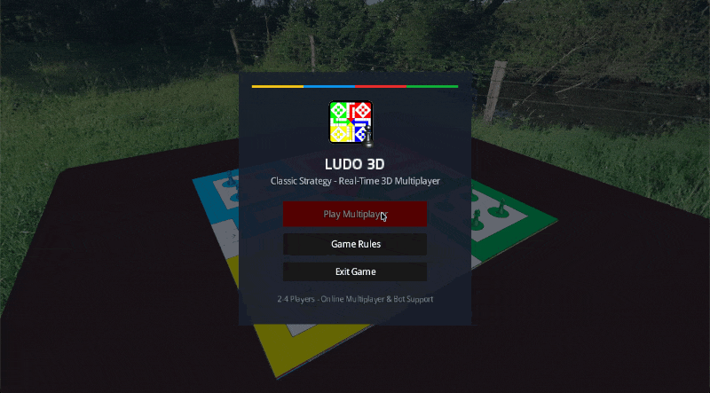
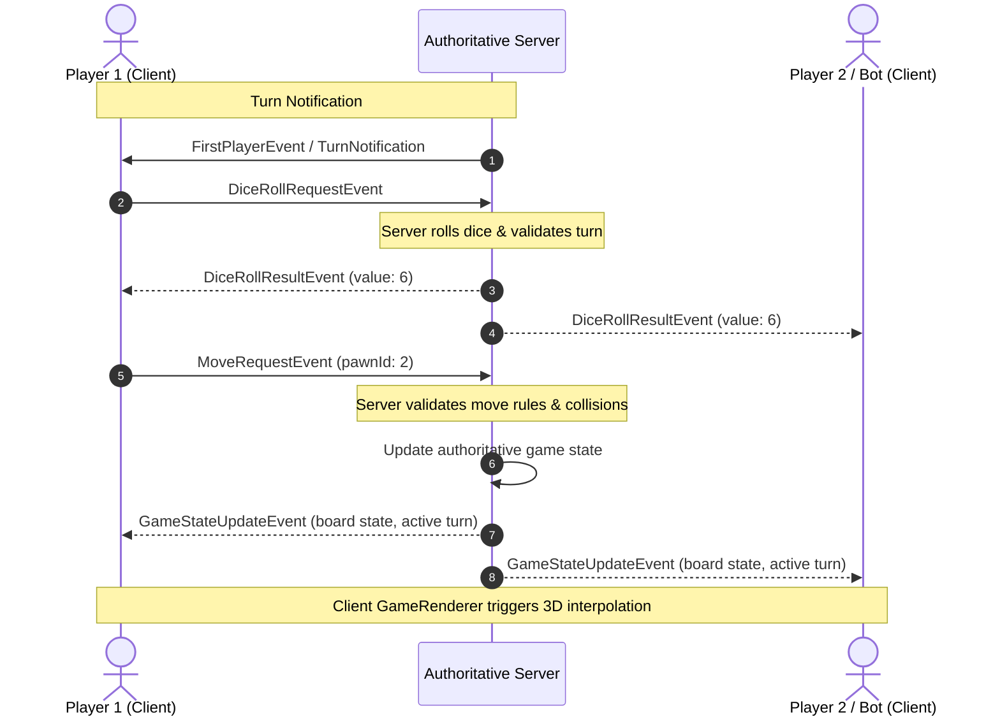

# 🎲 Ludo 3D — Distributed Multiplayer Board Game

[]()
[](https://libgdx.com/)
[]()
[]()
[](LICENSE)

> A networked, authoritative client-server 3D board game built in Java with custom TCP/IP socket networking, event-driven state synchronization, autonomous AI bot players, and LibGDX 3D graphics.

---

## 📽️ Gameplay Demo



*Demonstration of real-time multiplayer synchronization across multiple client instances, featuring 3D pawn movement interpolation, dice rolls, and server-authoritative state resolution.*

---

## ⚡ Technical Highlights

- **Authoritative Client-Server Model**: Game state, turn progression, dice rolls, and victory conditions are strictly validated and managed server-side to guarantee integrity and prevent desynchronization.
- **Custom Event-Driven TCP Protocol**: Engineered a modular event bus using polymorphic `Event` packets (`clientToServer` and `serverToClient`) transmitted over raw TCP sockets, complete with connection heartbeats (Ping/Pong) and reconnection handling.
- **3D Graphics & Rendering Pipeline**: Built using LibGDX's 3D API, featuring 3D mesh rendering (`g3db`), PBR-inspired material textures, cubemap skybox environment mapping, and smooth 3D pawn motion interpolation.
- **Autonomous AI Bot Players**: Built-in intelligent `BotPlayer` agents that emulate player actions, evaluate board positions, and seamlessly fill unassigned lobby slots.
- **State Persistence & Autosave**: Robust JSON-based persistence engine (`GamePersistence`) capable of automatic turn-by-turn state saves, on-demand manual saves, and mid-game recovery.
- **Comprehensive Test Suite**: Over 10 dedicated unit and integration test suites covering concurrent socket interactions, board graph traversal, turn state machines, and win conditions.

---

## 🏛️ System Architecture

The game utilizes a decoupled, event-driven client-server architecture communicating over persistent TCP sockets:



---

## 📁 Project Structure

This multi-module Gradle project enforces strict separation of concerns across runtime boundaries:

| Module | Description | Key Responsibilities |
| :--- | :--- | :--- |
| **`core/`** | Shared domain & networking contract | Game entities (`Board`, `Pawn`, `Dice`, `Player`), JSON persistence, and polymorphic network `Event` definitions. |
| **`server/`** | Standalone authoritative game server | Socket listener, connection pool manager, event handlers (`IEventHandler`), heartbeat pingers, and state machine. |
| **`client/`** | Client game logic & UI | Screen manager (`MenuScreen`, `LobbyScreen`, `GameScreen`), Scene2D HUD, input processors, and client event handlers. |
| **`lwjgl3/`** | Desktop platform launcher | LWJGL3 desktop backend entry point, window configuration, and OpenGL canvas initialization. |
| **`test/`** | Integration & unit test suite | Automated testing for network loops, state manager transitions, bot heuristics, and board mechanics. |

---

## 🚀 Getting Started

### Prerequisites
- **Java Development Kit (JDK)**: Version 17 or higher
- **Gradle**: Included via the `./gradlew` wrapper

### 1. Clone the Repository
```bash
git clone https://github.com/juvrajsb/Ludo3D.git
cd Ludo3D
```

### 2. Run the Server
Launch the authoritative server on port `12000` (default):
```bash
./gradlew :server:run
```

### 3. Run the Client(s)
In separate terminal windows, start one or more client instances:

**Linux / Windows:**
```bash
./gradlew :lwjgl3:run
```

**macOS** *(requires `-XstartOnFirstThread` for LWJGL/GLFW display)*:
```bash
./gradlew :lwjgl3:run -DjvmArgs="-XstartOnFirstThread"
```

Once launched:
1. Choose a username.
2. Connect to server (`localhost` and port `12000`).
3. Create or join a lobby, configure AI bots if desired, and start the game!

---

## 🛠️ Building Standalone JARs

To assemble executable JAR files for distribution:
```bash
./gradlew build
```
Compiled JARs will be generated in:
- Server: `server/build/libs/`
- Client: `lwjgl3/build/libs/`

---

## 🧪 Testing

Execute the automated unit and integration test suite:
```bash
./gradlew test
```

Test coverage includes:
- `BoardMovementTest` & `BoardTest`: Board path geometry, home stretches, and pawn capture mechanics.
- `GameStateTest` & `GameStateIntegrationTest`: Turn rotations, extra rolls on 6, and game-over detection.
- `NetworkIntegrationTest`: Socket event transmission, payload serialization, and connection lifecycles.
- `BotPlayerTest`: Autonomous decision-making and valid move selection.

---

## 📜 Attributions & License

- **License**: Released under the [MIT License](LICENSE).
- **Third-Party Assets**: All external libraries, textures, models, and UI skins are documented in [ATTRIBUTION.md](ATTRIBUTION.md).
